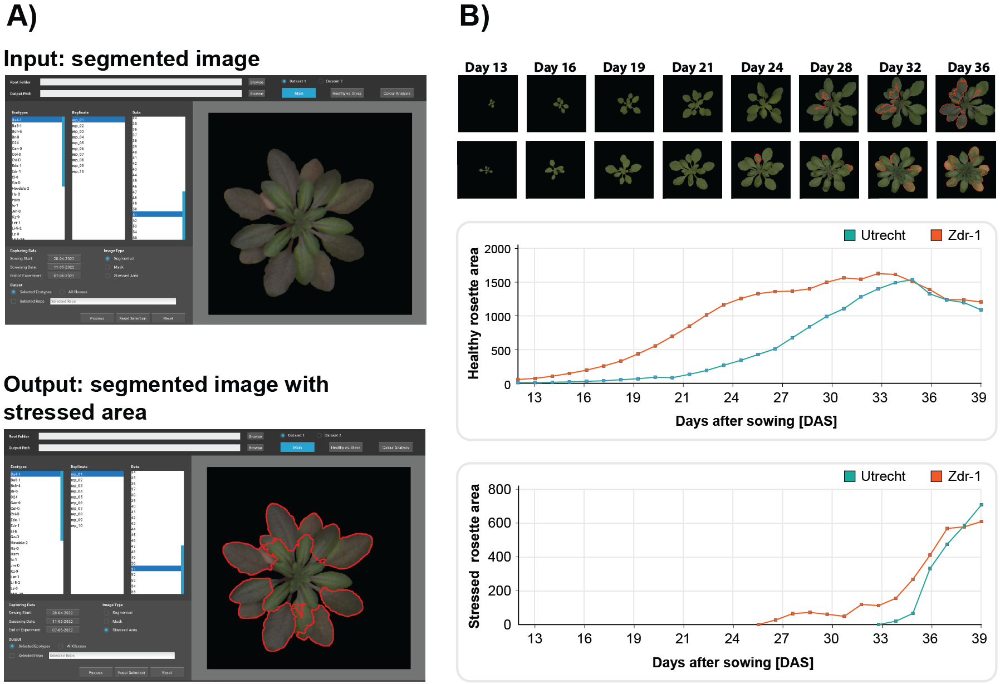

# GUI-based extraction and analysis of Arabidopsis thaliana physiological traits 

This repository provides the source code for the Graphical User Interface (GUI) developed to automatically detect stress regions on the _A. thaliana_ canopy and to analyse healthy and stressed areas, including their dominant colours.

## Description

GUI and workflow for detecting stress regions within the rosette area (see Figure 1):  
The figure below shows an example of the main page of the developed GUI, along with an example of an input segmented image and the corresponding output image with detected stress regions. The figure also presents the output of healthy and stressed rosette areas for two _A. thaliana_ ecotypes.



**Figure 1**. The workflow of the developed GUI for stress detection and colour analysis for _A.thaliana_ plants

## Requirements
- [python>=3.7](https://www.python.org/downloads/)
- [matplotlib](https://pypi.org/project/matplotlib/)
- [numpy](https://pypi.org/project/numpy/)
- [scikit-learn](https://pypi.org/project/scikit-learn/)
- [pillow](https://pypi.org/project/pillow/)
- [opencv-python](https://pypi.org/project/opencv-python/)
- [kyvi](https://pypi.org/project/Kivy/)

## Structure
The fundamental filesystem structure resembles the tree shown below. Essentially, we have two main folders: ```code```.
```console
code
├───analyzer.py
├───displaybox.py
├───inputbox.py
├───listbox.py
├───main.py
├───manager.py
└───settingbox.py
```

## LICENSE
This repo is distributed under [LICENSE](LICENSE).
